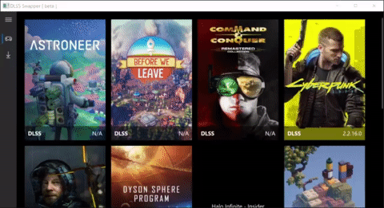

 
 <h2 align="center">DLSS Swapper
</h2>
 
DLSS Swapper is a tool that allows you to conveniently download, manage, and swap <strong>DLSS</strong>, <strong>FSR</strong> and <strong>XeSS</strong> dlls allowing you to upgrade or downgrade DLSS, FSR and XeSS version in a game without the game needing an update.

    
      
      
      

    <a href="https://github.com/beeradmoore/dlss-swapper/issues/new?template=bug_report.yml">Report Bug</a>
    ·
    <a href="https://github.com/beeradmoore/dlss-swapper/issues/new?template=feature-request.md">Request Feature</a>
    

    <a href="https://github.com/beeradmoore/dlss-swapper">English</a>
    ·
    <a href="https://github.com/beeradmoore/dlss-swapper/blob/main/docs/readme_pt-BR.md">Português BR</a>
    

    

## Why would you want to change the DLSS dlls in your game?

See [this](https://youtube.com/clip/UgzYyeox3s7jFJZAvYF4AaABCQ) clip, or better yet just watch the entire video ([Lego Builder's Journey Ray Tracing Showcase + DLSS 2.2 Upgrades Analysis](https://www.youtube.com/watch?v=dtbqJXb1UDw)) from Digital Foundry. DLSS 2.2 discussions start at 11:40.

## Please note

This tool does **NOT** allow you to add DLSS to games that don't support it.

This tool does **NOT** guarantee that swapping DLSS dlls will:

- Improve DLSS performance.
- Reduce DLSS artifacts.
- Give a crash free experience.

In many cases you may fix some issues, in other cases you may prevent a game from launching (until you restore your original dll, provided in the tool).

Happy experimenting. As my university professor once said,

> The good thing about computer [science] is we will never die wondering 'What if...?'

Please, come and share your DLSS experience over in [r/DLSS_Swapper](https://www.reddit.com/r/DLSS_Swapper/).

## How do I get it?

You can get the latest builds from our [GitHub releases](https://github.com/beeradmoore/dlss-swapper/releases) page.

## It would be cool if DLSS Swapper could...

Create a [feature request](https://github.com/beeradmoore/dlss-swapper/issues/new?template=feature-request.md).

## How can I contribute?

More info on this soon.

## Minimum System Requirements

| Requirement | Description                           |
| ----------- | ------------------------------------- |
| OS          | Windows 10 64-bit (20H1, build 19041) |
| GPU         | Any compatible model                  |
