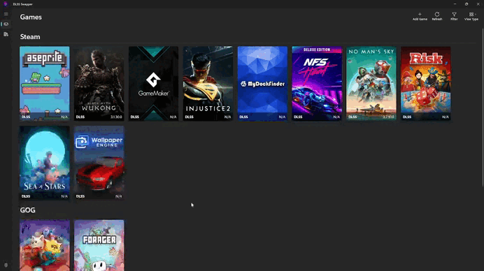

 
 <h2 align="center">DLSS Swapper
</h2>
 
DLSS Swapper 是一款實用的小工具，能夠讓你方便地下載、管理與切換 <strong>DLSS</strong>、<strong>FSR</strong> 和 <strong>XeSS</strong> 的 DLL 檔案，使你能夠在不更新遊戲的情況下更新或是回退 DLSS、FSR 和 XeSS 的版本。

    
    
    
    

    <a href="https://github.com/beeradmoore/dlss-swapper/releases">發行版本</a>
    ·
    <a href="https://github.com/beeradmoore/dlss-swapper/issues/new?template=bug_report.yml">Bug 回報</a>
    ·
    <a href="https://github.com/beeradmoore/dlss-swapper/issues/new?template=feature_request.yml">功能請求</a>

    <a href="../../README.md">English</a>
    ·
    <a href="./readme_pt-BR.md">Português BR</a>
    ·
    <a href="./readme_es.md">Español</a>
    ·
    <a href="./readme_ja-JP.md">日本語</a>
    ·
    繁體中文

    

## 它支援哪些遊戲庫？

- [Steam](https://store.steampowered.com/)
- [GOG](https://www.gog.com/en/)
- [Epic Games](https://store.epicgames.com/)
- [Ubisoft Connect](https://www.ubisoft.com/)
- [Xbox App](https://www.xbox.com/)
- 透過 `Add Game` 按鈕來手動新增其他遊戲。

## 為何要更換遊戲中的 DLSS dll？

請參閱[此影片](https://youtube.com/clip/UgzYyeox3s7jFJZAvYF4AaABCQ)的片段，或最好是直接觀看 Digital Foundry 的整部影片 ([Lego Builder's Journey Ray Tracing Showcase + DLSS 2.2 Upgrades Analysis](https://www.youtube.com/watch?v=dtbqJXb1UDw))。討論有關 DLSS 2.2 的部分在影片的 11:40 處開始。

## 注意事項

此工具**無法**讓你將 DLSS 加入到未支援 DLSS 的遊戲中。

此工具**無法**保證在更換 DLSS dll 能夠獲得：

- 提升 DLSS 的性能表現。
- 降低 DLSS 所帶來的偽影問題。
- 讓遊戲不再閃退崩潰。

在許多情況下，你可能可以利用這個方法修復一些問題，在其他情況下，也可能導致遊戲無法正常啟動（直到你使用工具中提供的原始 dll 檔案進行還原）。

祝你實驗愉快。正如我的大學教授曾經說的話，

> 計算機[科學]的美妙之處在於，我們永遠不會帶著「如果……？」的疑問離開人世。

歡迎你在 [r/DLSS_Swapper](https://www.reddit.com/r/DLSS_Swapper/) 分享你有關 DLSS 的各種經驗。

## 要如何取得這個工具？

你可以在我們的 [GitHub releases](https://github.com/beeradmoore/dlss-swapper/releases) 頁面取得最新版本。

## 如果 DLSS Swapper 可以做到...那就太ㄅㄧㄤ ˋ 了...

建立一個[功能請求](https://github.com/beeradmoore/dlss-swapper/issues/new?template=feature_request.yml)。

## 我能做出哪些貢獻？

更多資訊很快就會發佈...

## 最低系統需求

| 需求     | 說明                                     |
| -------- | ---------------------------------------- |
| 作業系統 | Windows 10 64-bit (20H1, 內部版本 19041) |
| 顯示卡   | 不限                                     |
